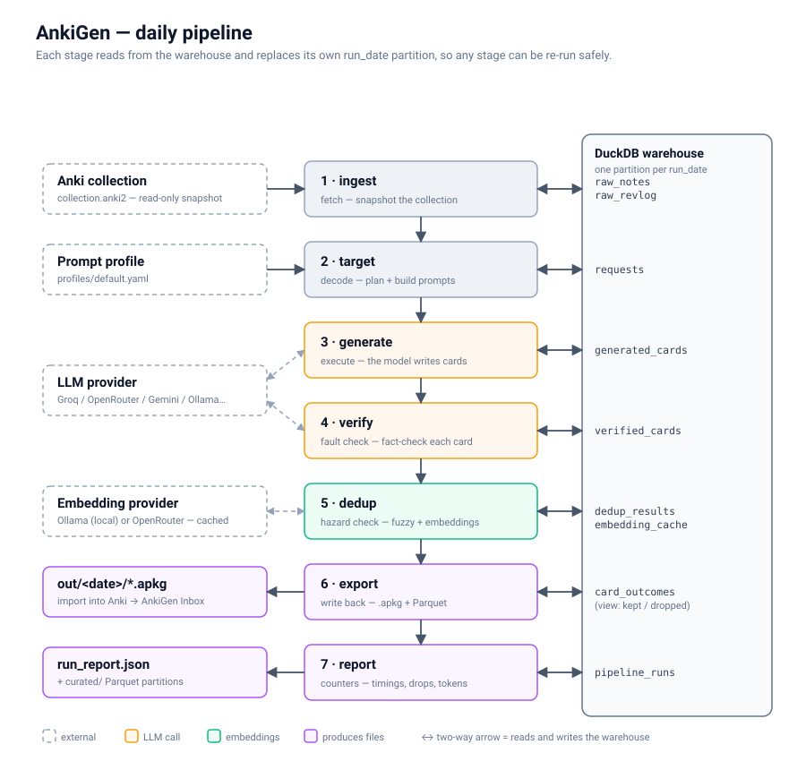

# AnkiGen

A daily batch pipeline that reads your Anki collection and writes new cards
that fit it. The cards match the phrasing of cards you already study, avoid what
you already know, re-teach what you keep forgetting, and are fact-checked before
they reach you. You steer it with one YAML profile.

It is also built the way a data platform team would build it: idempotent stages
keyed by date, a layered DuckDB warehouse, and output as Parquet. That makes it
ready to schedule with Airflow, containerise, and move to S3 and Kubernetes. See
the [roadmap](#roadmap).

<p align="center">
  
</p>

## Quick start

```bash
pip install .                      # installs the `ankigen` command
cp .env.example .env               # set LLM_PROVIDER / LLM_API_KEY (Groq is free)
ankigen decks                      # see your decks, to write the profile
ankigen validate                   # check profiles/default.yaml against them
ankigen plan                       # what today's run would generate + the exact prompt
ankigen run                        # do it
ankigen report                     # what was kept, dropped, and why
```

Import `data/out/<date>/ankigen_<date>.apkg` into Anki with File > Import.
Cards land **straight in their deck**, tagged `ankigen::run_<date>` so a batch
can be found or deleted later. Anything close to a card you already have is
tagged `ankigen::near-dup` with what it resembles, so search that tag first and
delete the few that are redundant. Re-importing the same day's package updates
those notes instead of duplicating them. (Set `inbox:` in the profile to file
them in a subdeck instead.)

Anki can stay open. It holds the collection exclusively, so the snapshot falls
back to copying the database with its `-wal` sidecar when the backup API cannot
get a lock.

## What each stage does

| Stage | Reads | Writes | Notes |
|---|---|---|---|
| **ingest** | your `collection.anki2` | `raw_notes` (daily snapshot), `raw_revlog` (incremental) | Snapshots through SQLite's backup API, so reviews still in the `-wal` file are included. A plain file copy misses them, and there's a test proving it. Handles both schema generations and any note type, from `Front/Back` to `Frente/Verso`. |
| **target** | `raw_notes`, profile | `requests` (with the rendered prompt) | Deterministic. The same date always produces the same plan, and topics and weak cards rotate day to day. No LLM calls, so `plan` is instant. |
| **generate** | `requests` | `generated_cards` | The only non-deterministic stage. If one request fails, the rest of the run still goes ahead. |
| **verify** | `generated_cards` | `verified_cards` | A second LLM pass fact-checks each card, ideally on a *different* model (`VERIFY_MODEL`) — a model marking its own homework shares its blind spots. On real runs it catches roughly a third of what the generator writes. If the checker is down, cards pass through tagged `ankigen::unverified` rather than being dropped. |
| **dedup** | the above + `raw_notes` + previous runs | `dedup_results` | Compared against your **whole collection**, not just the target deck — a fact you already have in `DS::SQL` is not new because a run asked for it under Data Platform. Embedding similarity catches rephrasings; fuzzy matching runs over the nearest twenty by meaning. Cards just below the duplicate threshold are kept and tagged `ankigen::near-dup` rather than dropped unseen. |
| **images** | kept cards wanting one | `card_images` | Only for cards whose answer could be drawn — an architecture, a lifecycle, the shape of a plot. Found by web search, then **shown to the model with the card** and kept only if it actually illustrates it — search engines match the words around a picture, never the picture, so a card about S3's flat namespace once arrived with a stock photo of a basketball player. Everything is re-encoded to JPEG because Anki silently drops some PNGs. |
| **export** | `card_outcomes` view | `.apkg`, Parquet | Stable note GUIDs and stable deck and note-type IDs. |
| **report** | `pipeline_runs` + all of the above | `run_report.json` | Per-stage timings, drops with reasons, and token usage. |

Every stage replaces its own `run_date` partition in a single transaction.
Re-running any stage for any date is therefore safe. Retrying `dedup` or
`export` never calls the model and never changes which cards exist.

```bash
ankigen run --date 2026-09-22 --stage dedup --stage export --stage report
```

## The profile

`profiles/default.yaml` is where personalisation lives:

```yaml
learner:
  level: "working data scientist, moving into data platform"
  goals: ["Interview-ready on core data science: statistics, SQL, ML"]
style:
  max_answer_words: 40
  examples_per_prompt: 4          # few-shot examples drawn from YOUR cards
  rules: ["When a concept has a common misconception, target it."]
weak_cards: {min_lapses: 2, max_ease: 2100, max_per_deck: 1}
global_quota: 15
decks:
  - deck: DS::SQL                 # existing deck: extend it in your own voice
    daily_quota: 3
    topics: [window functions, NULL semantics]
    instructions: Use small SQL snippets in backticks.
  - deck: Data Platform::Airflow  # a subject you don't have yet
    new_deck: true
    topics: [idempotent tasks and safe backfills]
```

Every generation prompt is built from:

- your learner profile and style rules;
- a few real cards from that deck as examples, so new cards match your phrasing and length;
- the existing cards most related to today's topic, as a do-not-duplicate list (unrelated cards are left out to save tokens);
- for weak cards, the card you keep failing, with an instruction to approach it from a different angle rather than rephrase it.

`ankigen plan --prompts 3` prints exactly what will be sent.

## LLM providers

Any OpenAI-compatible endpoint works. Set `LLM_PROVIDER` to a preset (`groq`,
`openrouter`, `nvidia`, `sambanova`, `mistral`, `ollama`) or to `gemini`.
Two setups are worth knowing:

Embeddings are configured separately, because most free chat APIs serve none.
Left unset they fall back to **fastembed**, which runs an ONNX model in-process:
no server, no key, no quota, and the only option that works unchanged on a CI
runner.

| | Generation | Free limits (measured Sept 2026) |
|---|---|---|
| **Most headroom** | `groq` | 1000 requests/day |
| **Best cards** | `gemini` | 20 requests/day **per model** — far tighter than the blog posts claim |
| **Offline** | `ollama` | unlimited, and noticeably weaker cards |

A run costs about seven generation calls and seven checking calls, which is why
`VERIFY_MODEL` pointing at a second model matters on Gemini: it doubles the
allowance *and* gives an independent opinion.

```
LLM_PROVIDER=gemini
GOOGLE_API_KEY=...
VERIFY_MODEL=gemini-3.5-flash   # a different model checks what the first wrote
```

If embeddings are configured but unreachable, dedup **fails** rather than
quietly reporting "no duplicates" — falling back silently once replaced four
runs of good results with that claim. Fuzzy-only matching has to be asked for.

`ankigen providers` shows the resolved configuration and tests the connection.

## Development

```bash
pip install -e ".[dev]"
python -m pytest
```

The tests build real SQLite collections in both Anki schemas and replace the LLM
and embedding provider with deterministic fakes, so they run offline in a few
seconds.

> **Non-ASCII paths:** an editable install can't be built from a directory whose
> path contains characters outside the system codepage, because setuptools
> writes a `.pth` file in that encoding. pytest is configured with
> `pythonpath = ["src"]`, and `python -m ankigen` works with `PYTHONPATH=src`.

## Running it daily

Without leaving a machine on: a [GitHub Actions workflow](.github/workflows/daily-cards.yml)
runs the pipeline on GitHub's runners each morning. It syncs your collection
down from AnkiWeb, writes the cards, and syncs them back, so they appear on your
phone and desktop with nothing to import. Free on a public repo, two secrets to
set up — see [docs/GITHUB_ACTIONS.md](docs/GITHUB_ACTIONS.md).

There is also an [Airflow stack](infra/airflow/) that runs the same eight stages
as eight tasks, which is the orchestration you would use at work; it needs
something to be on, so Actions is what actually fires daily.

## Roadmap

1. ✅ **Core pipeline**: personalised, verified, deduplicated, illustrated daily cards.
2. ✅ **Scheduled**: GitHub Actions daily; an Airflow DAG for local orchestration.
3. **Feedback loop**: the review history is already ingested — measure whether generated cards lapse more than hand-written ones, and whether illustrated cards stick better.
4. **Docker**: multi-stage image; the collection and profile mounted read-only.
5. **AWS free tier**: S3 `raw/`, `curated/` and `gold/` layers via Terraform, and a least-privilege IAM role.
6. **Kubernetes**: `CronJob` on `kind`, then `KubernetesPodOperator` per stage.
7. Later: PDF ingestion as a second source, and the Android client (see branch `archive/android-web`).
